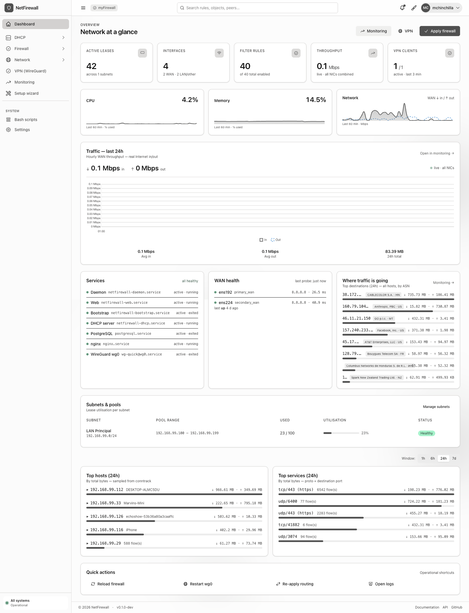
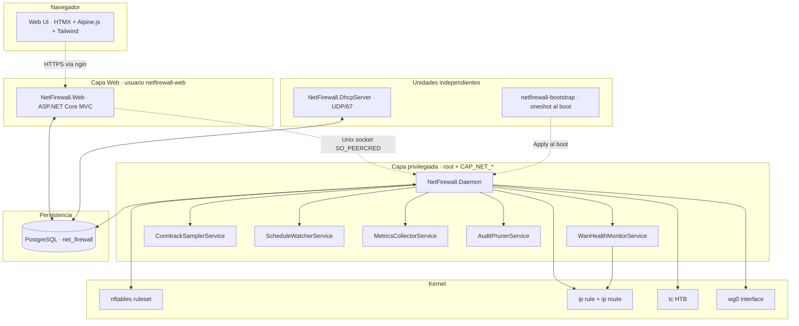
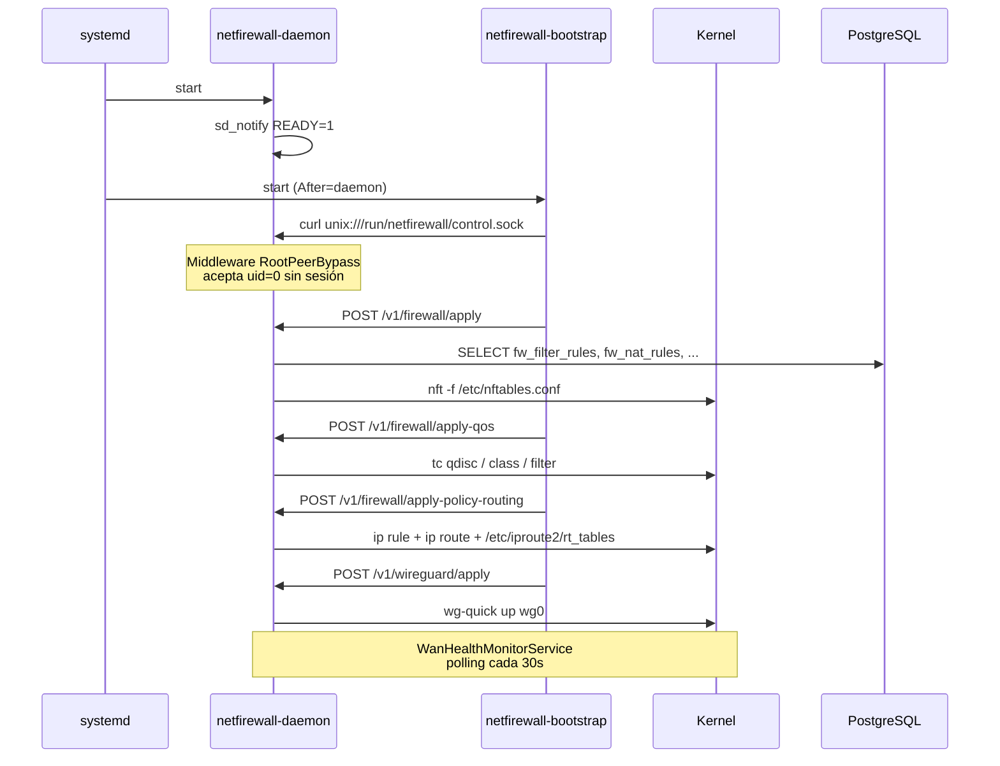
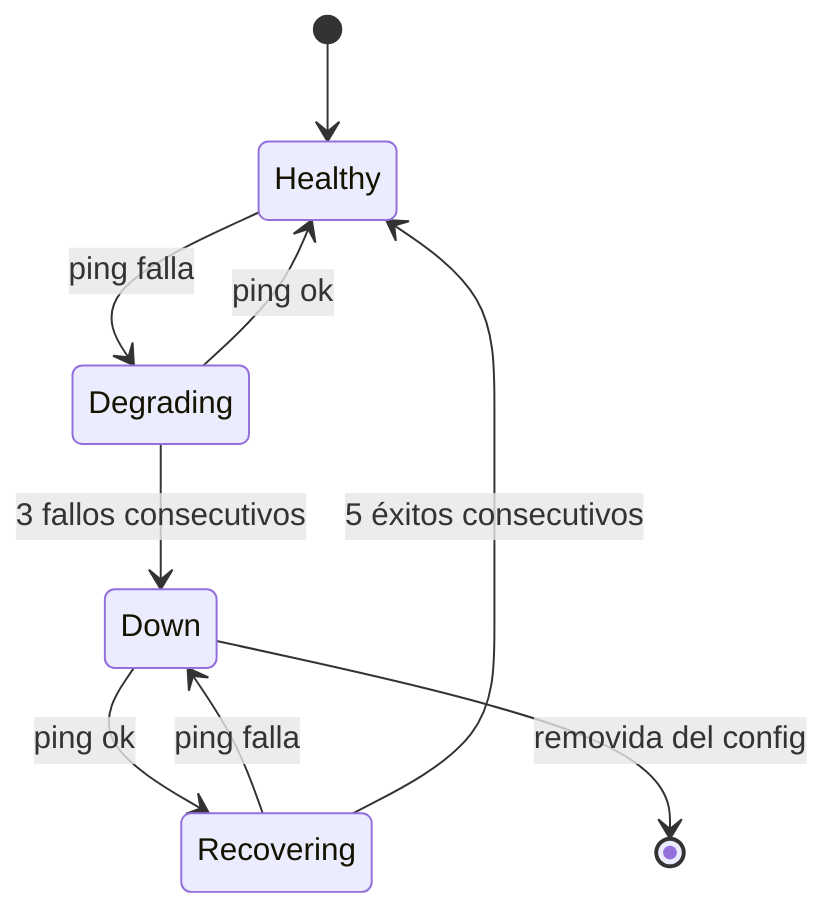

<div align="center">

[🇺🇸 English](README.md) · 🇪🇸 **Español**

# 🛡️ NetFirewall

**Firewall moderno, autohospedado y single-pane construido desde cero en C# / .NET 10**

[](https://dotnet.microsoft.com/)
[](https://www.postgresql.org/)
[](https://wiki.nftables.org/)
[](LICENSE.txt)
[]()

nftables · DHCP · WireGuard · failover dual-WAN · QoS · policy routing — todo dirigido desde una sola base de datos, aplicado por un solo daemon, administrado desde un solo Web UI.

</div>

---

## 📸 Panel principal



Vista única consolidada: KPIs arriba, gráfica de tráfico + eventos críticos en segunda fila, salud de servicios + WAN, subnets, top talkers y atajos operativos.

## ✨ Qué hace

| Módulo | Lo que obtienes |
|---|---|
| 🛡️ **Firewall** | Ruleset de nftables generado desde la DB — filter rules, NAT, port forwards, mangle, traffic marks. Apply con un click; backup antes de cada push. |
| 📡 **Servidor DHCP** | Servidor RFC 2131 en C# puro con PXE boot, subnets/pools/exclusiones/reservas MAC/DDNS, raw sockets AF_PACKET para manejar DISCOVER sin IP. |
| 🌐 **Failover dual-WAN** | Health monitor en el daemon pinguea cada WAN vía fwmark de policy routing (para que el probe salga por el enlace correcto), con histéresis (3 fallos → down, 5 éxitos → up). Cambio automático de default route. |
| 🔐 **VPN WireGuard** | Ambos modos: hub-server con N peers Y cliente-saliente a un servidor remoto. Importación de archivos `/etc/wireguard/*.conf` existentes hacia la DB. |
| 📊 **QoS (tc HTB)** | Hierarchical Token Bucket por interface con porcentajes de banda por traffic mark. |
| 🛣️ **Policy routing** | `fw_route_tables` + `fw_policy_rules` modelan `ip rule` + `ip route` declarativamente. El daemon reconcilia `/etc/iproute2/rt_tables` + estado del kernel. |
| 📈 **Monitoreo** | Health de servicios systemd, alcance WAN, top talkers (sampler de conntrack), gráficas de tráfico, detector de pending changes. |
| 👤 **Auth** | Session cookies, enrollment TOTP + recovery codes, elevation para ops destructivas, audit log completo. |

## 🏗️ Arquitectura



El daemon es el único proceso que muta el kernel. El Web corre sin capabilities, y se comunica con el daemon vía Unix socket protegido por `SO_PEERCRED` + session token. La configuración persistente vive en PostgreSQL; el estado del kernel es una vista derivada que el daemon reconcilia bajo demanda.

## ⚙️ Componentes

```
NetFirewall/
├── NetFirewall.Daemon           # HTTP sobre Unix socket privilegiado — toda mutación del kernel pasa aquí
├── NetFirewall.Web              # ASP.NET Core MVC — HTMX + Alpine.js + Tailwind 4
├── NetFirewall.DhcpServer       # RFC 2131 + PXE — unidad systemd independiente
├── NetFirewall.Tui              # TUI en Spectre.Console para admin de emergencia
├── NetFirewall.Services         # Lógica de negocio + Npgsql + sql/migrations/
├── NetFirewall.Models           # POCOs (DHCP, Firewall, Vpn, WanMonitor, Auth)
├── NetFirewall.Migrations       # Runner SQL forward-only
├── NetFirewall.Benchmarks       # BenchmarkDotNet para validar hot paths
├── NetFirewall.Tests            # xUnit + Aspire.Hosting.Testing
└── deploy/
    ├── systemd/                 # Units endurecidas
    ├── bootstrap/               # Script /usr/local/bin/netfirewall-bootstrap
    ├── nginx/                   # Ejemplo de reverse proxy
    ├── seeds/                   # Seed SQL por deployment
    └── install.sh               # Instalador one-shot
```

## 🚀 Inicio rápido

### Requisitos

- 🐧 Debian 13 / Ubuntu 24.04 / Rocky 9 (systemd moderno + kernel 5.x+)
- 🟣 .NET 10 SDK + runtime
- 🐘 PostgreSQL 14+
- 🔧 Paquetes `nftables`, `iproute2`, `wireguard-tools`, `conntrack`
- 🌐 nginx (o cualquier reverse proxy) para terminar TLS

### Instalación

```bash
git clone https://github.com/your-org/NetFirewall /opt/tekium/src
cd /opt/tekium/src
deploy/install.sh
```

El instalador publica los cinco binarios (`daemon`, `web`, `dhcp-server`, `migrations`, `tui`), crea el grupo `netfirewall` + usuario `netfirewall-web`, prepara `/etc/netfirewall/`, `/var/lib/netfirewall/`, `/var/log/netfirewall/`, genera una llave maestra AES-256 para cifrar TOTP, aplica todas las migraciones y arranca los servicios.

### Verificación

```bash
systemctl status netfirewall-*
nft list ruleset | head
curl -sS https://fw.example.com/login
```

Abre `https://fw.example.com/setup/bootstrap?token=<token-impreso-en-journalctl>` para crear el primer admin.

## 🔄 Workflow de apply al boot



## 🌐 Failover dual-WAN

El `WanHealthMonitorService` del daemon corre cada 30s por defecto. Para cada fila habilitada de `wan_health_config`:

1. **Probe** — `ping -m <fwmark>` a cada target. El fwmark fuerza al kernel a respetar `ip rule fwmark X lookup wanN`, por lo que el probe sale por la WAN que se está probando incluso cuando el main table apunta a otra.
2. **Histéresis** — 3 fallos consecutivos marcan la WAN como `is_up=false`; 5 éxitos consecutivos la marcan como `is_up=true`.
3. **Reconciliación** — gana la WAN healthy con menor priority. Si cambió el ganador, `ip route replace default via <gw> dev <iface>` en la tabla main.
4. **Auditoría** — `wan_health_events` registra cada transición; `fw_apply_history` registra cada failover.



## 🗄️ Esquema de DB (26 migraciones)

| Rango | Dominio |
|---|---|
| `00001–00004` | Extensions + firewall core (interfaces, filter/NAT/mangle rules, traffic marks, static routes, QoS, audit log) |
| `00005–00010` | DHCP (legacy + subnets + pools + opciones + relay + failover + DDNS + setup wizard) |
| `00011` | Auth (users, sessions, secrets TOTP, auth audit log) |
| `00012–00013` | Métricas del sistema + app settings |
| `00014, 00021` | WireGuard (servers, peers, modos server/client) |
| `00015–00020` | Network objects, FQDN sets, perfil de usuario, search index, schedules, services |
| `00022` | Apply history (detección de drift por kind) |
| `00023` | Policy routing (named tables + reglas fwmark) |
| `00024` | LAN traffic samples (top talkers desde conntrack) |
| `00025–00026` | WAN health + probe fwmark |

Forward-only; la tabla `__migrations` guarda el SHA-256 de cada archivo aplicado para detectar drift.

## 🔐 Hardening

- **Separación de privilegios** — Daemon corre como root con `CapabilityBoundingSet=CAP_NET_ADMIN CAP_DAC_OVERRIDE CAP_NET_RAW CAP_CHOWN`. Web corre como `netfirewall-web` sin capabilities. Bootstrap es un oneshot que invoca al daemon vía Unix socket.
- **Sandbox de systemd** — `ProtectSystem=strict`, `ProtectKernelTunables/Modules/Logs`, `RestrictAddressFamilies` ajustadas por servicio (AF_PACKET para DHCP, AF_NETLINK para daemon), `SystemCallFilter=@system-service` menos `@mount @swap @reboot @raw-io`.
- **Flujo de auth** — Session cookie solo sobre HTTPS, TOTP obligatorio en el primer login, **elevation** (re-prompt TOTP) para endpoints destructivos (`apply firewall`, `update interface`, etc.).
- **Cifrado de TOTP** — la master key vive solo dentro del daemon (cargada desde `/etc/netfirewall/daemon.env`). El Web hace `POST /v1/crypto/encrypt|decrypt` por el Unix socket — un compromiso del Web no puede descifrar los secrets almacenados.

## 🛠️ Operaciones

### Apply manual vía curl (con bypass de root peer)

```bash
SOCK=/run/netfirewall/control.sock
curl --unix-socket "$SOCK" -X POST http://daemon/v1/firewall/apply
curl --unix-socket "$SOCK" -X POST http://daemon/v1/firewall/apply-qos
curl --unix-socket "$SOCK" -X POST http://daemon/v1/firewall/apply-policy-routing
curl --unix-socket "$SOCK" -X POST http://daemon/v1/wireguard/apply
```

### Migraciones

```bash
bin/db.sh status   # qué está aplicado / pendiente / con drift
bin/db.sh up       # aplica pendientes
bin/db.sh seed     # aplica seed demo (SOLO DEV)
```

### Audit + apply history

```sql
SELECT event_type, username, ip, occurred_at FROM auth_audit_log ORDER BY occurred_at DESC LIMIT 20;
SELECT kind, success, applied_at, applied_by, message FROM fw_apply_history ORDER BY applied_at DESC LIMIT 20;
```

## ⚠️ Obsoleto

Estos artefactos quedan en el repo como referencia pero ya no se usan en producción:

| Componente | Reemplazado por | Notas |
|---|---|---|
| `/root/firewall.sh` (o `Bash/firewall.sh`) | `netfirewall-bootstrap.service` + `fw_policy_rules` + `fw_route_tables` desde DB | El script viejo hacía `ip rule add` y `ip route add` directo; ahora lo reconcilia `IPolicyRoutingApplyService` desde la DB. |
| `NetFirewall.WanMonitor` (proceso standalone) | `WanHealthMonitorService` (HostedService dentro del daemon) | El monitor viejo shelleaba comandos y no tenía estado en DB. El nuevo persiste `wan_health_state` + `wan_health_events`. |
| `netfirewall-wanmonitor.service` | (ninguno — absorbido al daemon) | Desactiva y elimina si vienes de un deploy pre-2026-05. |
| `BashCommandsConfig.Extra{Primary,Secondary}Commands` | Endpoints de Apply del daemon | El WanMonitor viejo ejecutaba esas listas de bash en failover; el daemon ahora hace lo equivalente declarativamente. |

## 📖 Documentación

- [`docs/DEPLOY_HANDOFF.md`](docs/DEPLOY_HANDOFF.md) — estado del deployment + notas de handoff
- [`docs/PerformanceAnalysis.md`](docs/PerformanceAnalysis.md) — budget del hot path DHCP + reglas zero-allocation
- [`docs/DHCP_FEATURE_COMPARISON.md`](docs/DHCP_FEATURE_COMPARISON.md) — paridad de features vs isc-dhcp / kea
- [`CLAUDE.md`](CLAUDE.md) — reglas del proyecto (no negociables)

## 📜 Licencia

MIT — ver [LICENSE.txt](LICENSE.txt).

---

<div align="center">

**Construido con ❤️ en C# / .NET 10 · Powered by PostgreSQL + nftables**

</div>
