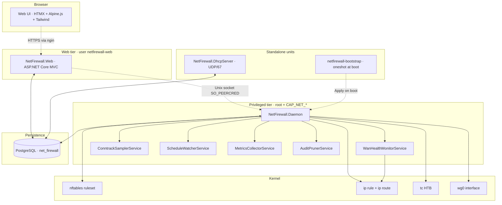
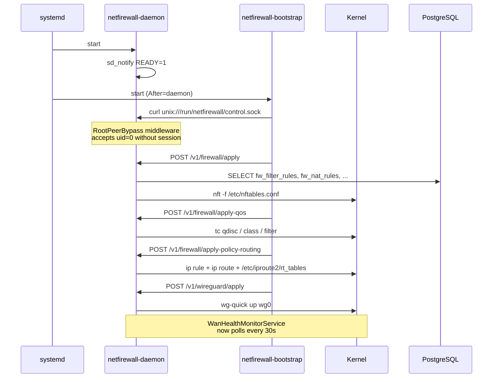
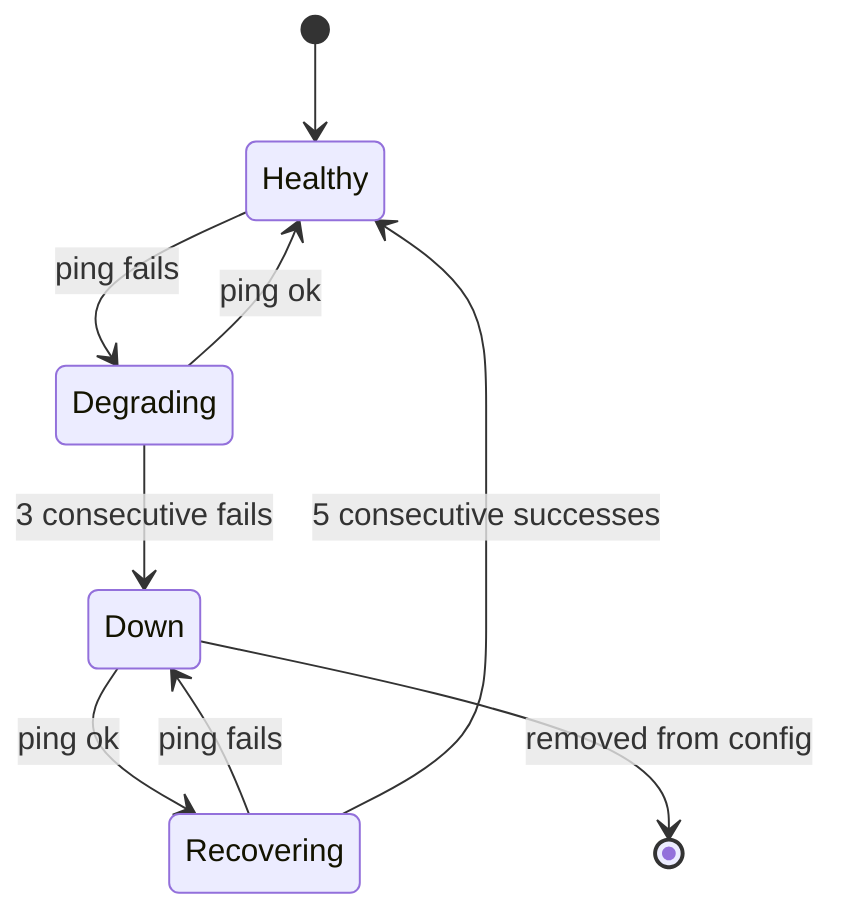

<div align="center">

🇺🇸 **English** · [🇪🇸 Español](README.es.md)

# 🛡️ NetFirewall

**A modern, self-hosted, single-pane firewall built from scratch in C# / .NET 10**

[](https://dotnet.microsoft.com/)
[](https://www.postgresql.org/)
[](https://wiki.nftables.org/)
[](LICENSE.txt)
[]()

nftables · DHCP · WireGuard · dual-WAN failover · QoS · policy routing — all driven from one database, applied by one daemon, managed from one Web UI.

</div>

---

## 📸 Dashboard


Single overview pane: KPIs at the top, traffic + critical events second, services + WAN health row, subnets, top talkers, and operational shortcuts.

## ✨ What it does

| Module | What you get |
|---|---|
| 🛡️ **Firewall** | Native nftables ruleset generated from DB — filter rules, NAT, port forwards, mangle, traffic marks. Apply with one click; backups taken before every push. |
| 📡 **DHCP server** | Pure-C# RFC 2131 server with PXE boot, subnets/pools/exclusions/MAC reservations/DDNS, AF_PACKET raw sockets for zero-IP DISCOVER handling. |
| 🌐 **Dual-WAN failover** | Daemon-side health monitor pings each WAN via fwmark policy routing (so probes hit the right link), with hysteresis (3 fails → down, 5 succ → up). Automatic default route swap when winner changes. |
| 🔐 **WireGuard VPN** | Both modes: hub-server with N peers AND outbound-client to a remote server. Import existing `/etc/wireguard/*.conf` files from disk into DB. |
| 📊 **QoS (tc HTB)** | Hierarchical Token Bucket per interface with per-traffic-mark class shares. |
| 🛣️ **Policy routing** | `fw_route_tables` + `fw_policy_rules` model `ip rule` + `ip route` declaratively. The daemon reconciles `/etc/iproute2/rt_tables` + kernel state. |
| 📈 **Monitoring** | systemd service health, WAN reachability, top talkers (conntrack sampler), traffic graphs, pending-changes detector. |
| 👤 **Auth** | Custom session cookies, TOTP enrollment + recovery codes, elevation gates for destructive ops, comprehensive audit log. |

## 🏗️ Architecture



The daemon owns every privileged kernel mutation. The Web is sandboxed (no caps), and talks to the daemon over a Unix socket gated by `SO_PEERCRED` + session token. Persistent config lives in PostgreSQL; the kernel is just a derived view that the daemon reconciles on demand.

## ⚙️ Components

```
NetFirewall/
├── NetFirewall.Daemon           # Privileged HTTP-on-Unix-socket — every kernel mutation goes here
├── NetFirewall.Web              # ASP.NET Core MVC — HTMX + Alpine.js + Tailwind 4
├── NetFirewall.DhcpServer       # RFC 2131 + PXE — independent systemd unit
├── NetFirewall.Tui              # Spectre.Console TUI for break-glass admin
├── NetFirewall.Services         # Business logic + Npgsql + sql/migrations/
├── NetFirewall.Models           # POCOs (DHCP, Firewall, Vpn, WanMonitor, Auth)
├── NetFirewall.Migrations       # Forward-only SQL migration runner
├── NetFirewall.Benchmarks       # BenchmarkDotNet hot-path validation
├── NetFirewall.Tests            # xUnit + Aspire.Hosting.Testing
└── deploy/
    ├── systemd/                 # Hardened unit files
    ├── bootstrap/               # /usr/local/bin/netfirewall-bootstrap script
    ├── nginx/                   # Reverse-proxy example
    ├── seeds/                   # Per-deployment seed SQL
    └── install.sh               # One-shot installer
```

## 🚀 Quick start

### Requirements

- 🐧 Debian 13 / Ubuntu 24.04 / Rocky 9 (any modern systemd + Linux 5.x)
- 🟣 .NET 10 SDK + runtime
- 🐘 PostgreSQL 14+
- 🔧 `nftables`, `iproute2`, `wireguard-tools`, `conntrack` packages
- 🌐 nginx (or any reverse proxy) for TLS termination

### Install

```bash
git clone https://github.com/your-org/NetFirewall /opt/tekium/src
cd /opt/tekium/src
deploy/install.sh
```

The installer publishes all five binaries (`daemon`, `web`, `dhcp-server`, `migrations`, `tui`), creates the `netfirewall` group + `netfirewall-web` user, lays out `/etc/netfirewall/`, `/var/lib/netfirewall/`, `/var/log/netfirewall/`, generates an AES-256 master key for TOTP encryption, applies all migrations, and starts both services.

### Verify

```bash
systemctl status netfirewall-*
nft list ruleset | head
curl -sS https://fw.example.com/login
```

Open `https://fw.example.com/setup/bootstrap?token=<token-printed-to-journalctl>` for first admin enrollment.

## 🔄 Boot-time apply workflow



## 🌐 Dual-WAN failover

The daemon's `WanHealthMonitorService` runs every 30s by default. For each enabled `wan_health_config` row:

1. **Probe** — `ping -m <fwmark>` to every monitor target. The fwmark forces the kernel to honor `ip rule fwmark X lookup wanN`, so the probe pins to the WAN being tested even when the main table points elsewhere.
2. **Hysteresis** — 3 consecutive failures flip the WAN to `is_up=false`; 5 consecutive successes flip it back.
3. **Reconcile** — lowest-priority healthy WAN wins. If the winner changed, `ip route replace default via <gw> dev <iface>` in the main table.
4. **Audit** — `wan_health_events` records every transition; `fw_apply_history` registers each failover.



## 🗄️ Database schema (26 migrations)

| Range | Domain |
|---|---|
| `00001–00004` | Extensions + firewall core (interfaces, filter/NAT/mangle rules, traffic marks, static routes, QoS, audit log) |
| `00005–00010` | DHCP (legacy + subnets + pools + options + relay + failover + DDNS + setup wizard) |
| `00011` | Auth (users, sessions, TOTP secrets, auth audit log) |
| `00012–00013` | System metrics + app settings |
| `00014, 00021` | WireGuard (servers, peers, modes) |
| `00015–00020` | Network objects, FQDN sets, user profile, search index, schedules, services |
| `00022` | Apply history (per-kind drift detection) |
| `00023` | Policy routing (named tables + fwmark rules) |
| `00024` | LAN traffic samples (conntrack-fed top talkers) |
| `00025–00026` | WAN health + probe fwmark |

Forward-only; `__migrations` table tracks SHA-256 of every applied file to detect drift.

## 🔐 Hardening

- **Privilege separation** — Daemon runs as root with `CapabilityBoundingSet=CAP_NET_ADMIN CAP_DAC_OVERRIDE CAP_NET_RAW CAP_CHOWN`. Web runs as unprivileged `netfirewall-web`. Bootstrap is a one-shot that calls the daemon over Unix socket.
- **Systemd sandbox** — `ProtectSystem=strict`, `ProtectKernelTunables/Modules/Logs`, `RestrictAddressFamilies` (carefully tuned per-service: AF_PACKET for DHCP, AF_NETLINK for daemon), `SystemCallFilter=@system-service` minus `@mount @swap @reboot @raw-io`.
- **Auth flow** — Session cookie issued only over HTTPS, TOTP required for first login, **elevation** gate (re-prompt TOTP) for destructive endpoints (`apply firewall`, `update interface`, etc.).
- **TOTP encryption** — master key lives only inside the daemon (loaded from `/etc/netfirewall/daemon.env`). The Web posts to `POST /v1/crypto/encrypt|decrypt` over the Unix socket — a Web compromise can't decrypt stored secrets.

## 🛠️ Operations

### Manual apply via curl (root peer bypass)

```bash
SOCK=/run/netfirewall/control.sock
curl --unix-socket "$SOCK" -X POST http://daemon/v1/firewall/apply
curl --unix-socket "$SOCK" -X POST http://daemon/v1/firewall/apply-qos
curl --unix-socket "$SOCK" -X POST http://daemon/v1/firewall/apply-policy-routing
curl --unix-socket "$SOCK" -X POST http://daemon/v1/wireguard/apply
```

### Migrations

```bash
bin/db.sh status   # what's applied / pending / drifted
bin/db.sh up       # apply pending
bin/db.sh seed     # apply demo seed (DEV ONLY)
```

### Tail audit + apply history

```sql
SELECT event_type, username, ip, occurred_at FROM auth_audit_log ORDER BY occurred_at DESC LIMIT 20;
SELECT kind, success, applied_at, applied_by, message FROM fw_apply_history ORDER BY applied_at DESC LIMIT 20;
```

## ⚠️ Deprecated

These artifacts are kept in the repo for reference but no longer active in production:

| Item | Replaced by | Notes |
|---|---|---|
| `/root/firewall.sh` (or `Bash/firewall.sh`) | `netfirewall-bootstrap.service` + DB-driven `fw_policy_rules` + `fw_route_tables` | Old script issued `ip rule add` and `ip route add` directly; now reconciled by `IPolicyRoutingApplyService` from DB. |
| `NetFirewall.WanMonitor` (standalone process) | `WanHealthMonitorService` (HostedService inside the daemon) | Old monitor shelled out and had no DB state. New one persists `wan_health_state` + `wan_health_events`. |
| `netfirewall-wanmonitor.service` | (none — absorbed into daemon) | Disable + remove if upgrading from a pre-2026-05 deployment. |
| `BashCommandsConfig.Extra{Primary,Secondary}Commands` | Daemon-driven Apply endpoints | Old WanMonitor invoked these bash lists on failover; daemon now does the equivalent declaratively. |

## 📖 Docs

- [`docs/DEPLOY_HANDOFF.md`](docs/DEPLOY_HANDOFF.md) — current deployment state + handoff notes
- [`docs/PerformanceAnalysis.md`](docs/PerformanceAnalysis.md) — DHCP hot path budget + zero-allocation rules
- [`docs/DHCP_FEATURE_COMPARISON.md`](docs/DHCP_FEATURE_COMPARISON.md) — feature parity vs isc-dhcp / kea
- [`CLAUDE.md`](CLAUDE.md) — project rules (non-negotiable)

## 📜 License

MIT — see [LICENSE.txt](LICENSE.txt).

---

<div align="center">

**Built with ❤️ in C# / .NET 10 · Powered by PostgreSQL + nftables**

</div>
