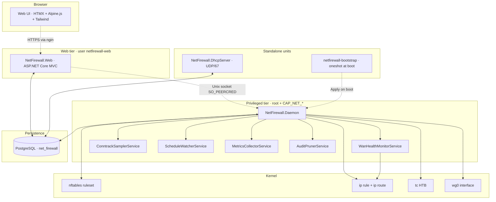
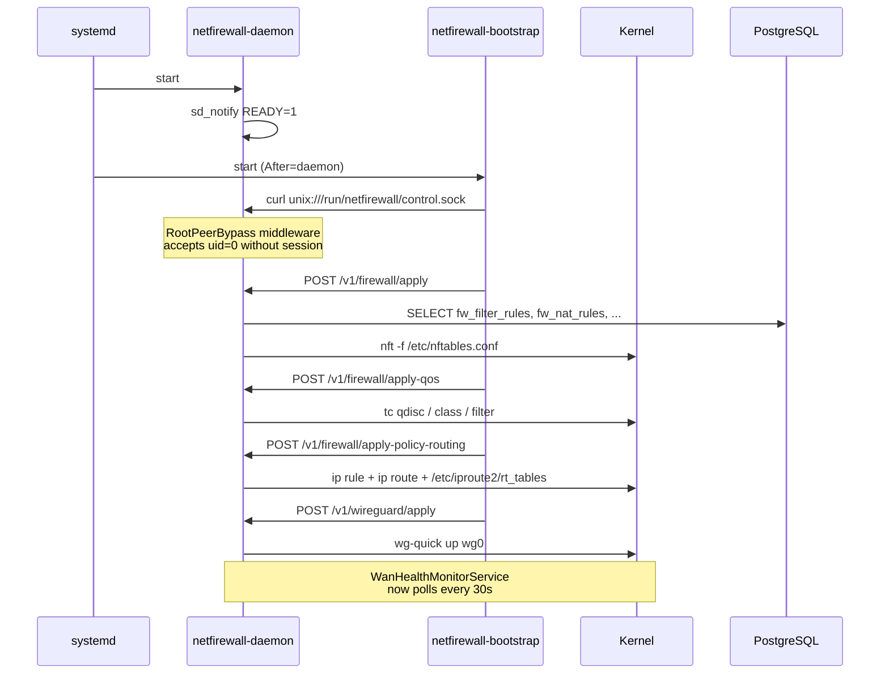
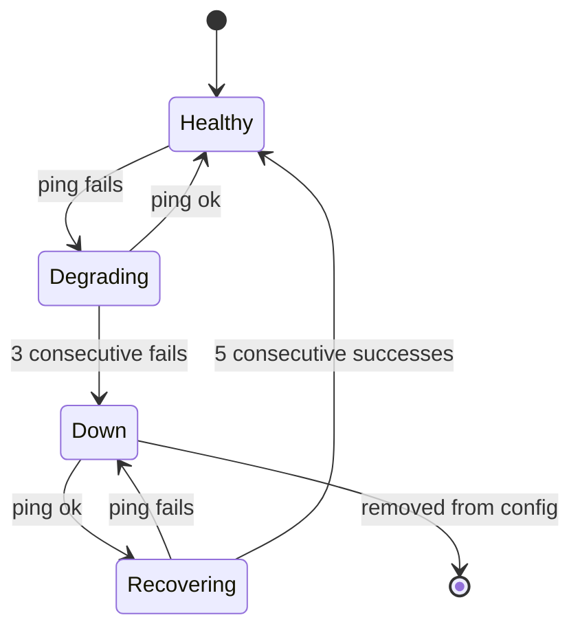

<div align="center">

🇺🇸 **English** · [🇪🇸 Español](README.es.md)

# 🛡️ NetFirewall

**A modern, self-hosted, single-pane firewall built from scratch in C# / .NET 10**

[](https://dotnet.microsoft.com/)
[](https://www.postgresql.org/)
[](https://wiki.nftables.org/)
[](LICENSE.txt)
[]()

nftables · DHCP · WireGuard · dual-WAN failover · QoS · policy routing — all driven from one database, applied by one daemon, managed from one Web UI.

</div>

---

## 📸 Dashboard


Single overview pane: KPIs at the top, traffic + critical events second, services + WAN health row, subnets, top talkers, and operational shortcuts.

## ✨ What it does

| Module | What you get |
|---|---|
| 🛡️ **Firewall** | Native nftables ruleset generated from DB — filter rules, NAT, port forwards, mangle, traffic marks. Apply with one click; backups taken before every push. |
| 📡 **DHCP server** | Pure-C# RFC 2131 server with PXE boot, subnets/pools/exclusions/MAC reservations/DDNS, AF_PACKET raw sockets for zero-IP DISCOVER handling. |
| 🌐 **Dual-WAN failover** | Daemon-side health monitor pings each WAN via fwmark policy routing (so probes hit the right link), with hysteresis (3 fails → down, 5 succ → up). Automatic default route swap when winner changes. |
| 🔐 **WireGuard VPN** | Both modes: hub-server with N peers AND outbound-client to a remote server. Import existing `/etc/wireguard/*.conf` files from disk into DB. |
| 📊 **QoS (tc HTB)** | Hierarchical Token Bucket per interface with per-traffic-mark class shares. |
| 🛣️ **Policy routing** | `fw_route_tables` + `fw_policy_rules` model `ip rule` + `ip route` declaratively. The daemon reconciles `/etc/iproute2/rt_tables` + kernel state. |
| 📈 **Monitoring** | systemd service health, WAN reachability, top talkers (conntrack sampler), traffic graphs, pending-changes detector. |
| 👤 **Auth** | Custom session cookies, TOTP enrollment + recovery codes, elevation gates for destructive ops, comprehensive audit log. |

## 🏗️ Architecture



The daemon owns every privileged kernel mutation. The Web is sandboxed (no caps), and talks to the daemon over a Unix socket gated by `SO_PEERCRED` + session token. Persistent config lives in PostgreSQL; the kernel is just a derived view that the daemon reconciles on demand.

## ⚙️ Components

```
NetFirewall/
├── NetFirewall.Daemon           # Privileged HTTP-on-Unix-socket — every kernel mutation goes here
├── NetFirewall.Web              # ASP.NET Core MVC — HTMX + Alpine.js + Tailwind 4
├── NetFirewall.DhcpServer       # RFC 2131 + PXE — independent systemd unit
├── NetFirewall.Tui              # Spectre.Console TUI for break-glass admin
├── NetFirewall.Services         # Business logic + Npgsql + sql/migrations/
├── NetFirewall.Models           # POCOs (DHCP, Firewall, Vpn, WanMonitor, Auth)
├── NetFirewall.Migrations       # Forward-only SQL migration runner
├── NetFirewall.Benchmarks       # BenchmarkDotNet hot-path validation
├── NetFirewall.Tests            # xUnit + Aspire.Hosting.Testing
└── deploy/
    ├── systemd/                 # Hardened unit files
    ├── bootstrap/               # /usr/local/bin/netfirewall-bootstrap script
    ├── nginx/                   # Reverse-proxy example
    ├── seeds/                   # Per-deployment seed SQL
    └── install.sh               # One-shot installer
```

## 🚀 Quick start

### Requirements

- 🐧 Debian 13 / Ubuntu 24.04 / Rocky 9 (any modern systemd + Linux 5.x)
- 🟣 .NET 10 SDK + runtime
- 🐘 PostgreSQL 14+
- 🔧 `nftables`, `iproute2`, `wireguard-tools`, `conntrack` packages
- 🌐 nginx (or any reverse proxy) for TLS termination

### Install the prerequisites

`deploy/install.sh` does **not** install OS packages — it only checks they're
present (`systemctl`, `dotnet`, `psql`, `openssl`) and fails fast if not. Install
everything the daemon shells out to first. The daemon invokes `nft`, `ip`, `tc`,
`wg` / `wg-quick`, `conntrack`, `ping`, and `systemctl` at runtime, so all of
their packages must be on the box.

**Debian / Ubuntu**

```bash
# system tools the daemon drives at runtime
apt update
apt install -y nftables iproute2 wireguard-tools conntrack iputils-ping \
               openssl curl ca-certificates

# PostgreSQL 14+ (server + client; psql is needed by the migration runner)
apt install -y postgresql postgresql-client

# nginx for TLS termination (skip if you front it with something else)
apt install -y nginx

# .NET 10 SDK — Microsoft feed (Debian/Ubuntu)
#   see https://learn.microsoft.com/dotnet/core/install/linux for your release
apt install -y dotnet-sdk-10.0      # or grab the tarball + add to PATH
```

**Rocky / Alma / RHEL 9**

```bash
dnf install -y nftables iproute-tc wireguard-tools conntrack-tools iputils \
               openssl curl postgresql-server postgresql nginx dotnet-sdk-10.0
postgresql-setup --initdb        # first-time PG cluster init on RHEL family
systemctl enable --now postgresql
```

**openSUSE**

```bash
zypper install -y nftables iproute2 wireguard-tools conntrack-tools iputils \
                  openssl curl postgresql-server postgresql nginx dotnet-sdk-10.0
```

> Package name notes: `conntrack` (Debian) = `conntrack-tools` (RHEL/SUSE);
> `tc` ships in `iproute2` (Debian) but `iproute-tc` (RHEL); `ping` is in
> `iputils-ping` (Debian) / `iputils` (RHEL/SUSE).

### Enable kernel features

The firewall is a router, so IPv4 forwarding must be on, and the dashboard's
top-talkers panel needs conntrack byte accounting (`conntrack -L` only emits
`bytes=` when `nf_conntrack_acct=1`). The installer drops
`/etc/sysctl.d/netfirewall.conf` with `nf_conntrack_acct`, but **forwarding is
your call** — set it explicitly:

```bash
# persistent: write a sysctl drop-in, then apply
cat >/etc/sysctl.d/99-netfirewall-router.conf <<'EOF'
net.ipv4.ip_forward = 1
net.netfilter.nf_conntrack_acct = 1
EOF
sysctl --system

# verify
sysctl net.ipv4.ip_forward net.netfilter.nf_conntrack_acct
```

> **Policy routing + `rp_filter`:** strict reverse-path filtering
> (`net.ipv4.conf.*.rp_filter=1`) silently drops fwmark-routed traffic whose
> reply path differs from its inbound interface. If marked traffic refuses to
> leave the intended WAN/VPN even though `ip rule` + the route table look
> correct, loosen it: `sysctl -w net.ipv4.conf.all.rp_filter=2` (loose mode).
> See diagnostics below.

### Install

```bash
git clone https://github.com/your-org/NetFirewall /opt/tekium/src
cd /opt/tekium/src
deploy/install.sh
```

The installer publishes all five binaries (`daemon`, `web`, `dhcp-server`, `migrations`, `tui`), creates the `netfirewall` group + `netfirewall-web` user, lays out `/etc/netfirewall/`, `/var/lib/netfirewall/`, `/var/log/netfirewall/`, generates an AES-256 master key for TOTP encryption, applies all migrations, and starts both services.

### Verify

```bash
systemctl status netfirewall-*
nft list ruleset | head
curl -sS https://fw.example.com/login
```

Open `https://fw.example.com/setup/bootstrap?token=<token-printed-to-journalctl>` for first admin enrollment.

## 🔄 Boot-time apply workflow



## 🌐 Dual-WAN failover

The daemon's `WanHealthMonitorService` runs every 30s by default. For each enabled `wan_health_config` row:

1. **Probe** — `ping -m <fwmark>` to every monitor target. The fwmark forces the kernel to honor `ip rule fwmark X lookup wanN`, so the probe pins to the WAN being tested even when the main table points elsewhere.
2. **Hysteresis** — 3 consecutive failures flip the WAN to `is_up=false`; 5 consecutive successes flip it back.
3. **Reconcile** — lowest-priority healthy WAN wins. If the winner changed, `ip route replace default via <gw> dev <iface>` in the main table.
4. **Audit** — `wan_health_events` records every transition; `fw_apply_history` registers each failover.



## 🗄️ Database schema (26 migrations)

| Range | Domain |
|---|---|
| `00001–00004` | Extensions + firewall core (interfaces, filter/NAT/mangle rules, traffic marks, static routes, QoS, audit log) |
| `00005–00010` | DHCP (legacy + subnets + pools + options + relay + failover + DDNS + setup wizard) |
| `00011` | Auth (users, sessions, TOTP secrets, auth audit log) |
| `00012–00013` | System metrics + app settings |
| `00014, 00021` | WireGuard (servers, peers, modes) |
| `00015–00020` | Network objects, FQDN sets, user profile, search index, schedules, services |
| `00022` | Apply history (per-kind drift detection) |
| `00023` | Policy routing (named tables + fwmark rules) |
| `00024` | LAN traffic samples (conntrack-fed top talkers) |
| `00025–00026` | WAN health + probe fwmark |

Forward-only; `__migrations` table tracks SHA-256 of every applied file to detect drift.

## 🔐 Hardening

- **Privilege separation** — Daemon runs as root with `CapabilityBoundingSet=CAP_NET_ADMIN CAP_DAC_OVERRIDE CAP_NET_RAW CAP_CHOWN`. Web runs as unprivileged `netfirewall-web`. Bootstrap is a one-shot that calls the daemon over Unix socket.
- **Systemd sandbox** — `ProtectSystem=strict`, `ProtectKernelTunables/Modules/Logs`, `RestrictAddressFamilies` (carefully tuned per-service: AF_PACKET for DHCP, AF_NETLINK for daemon), `SystemCallFilter=@system-service` minus `@mount @swap @reboot @raw-io`.
- **Auth flow** — Session cookie issued only over HTTPS, TOTP required for first login, **elevation** gate (re-prompt TOTP) for destructive endpoints (`apply firewall`, `update interface`, etc.).
- **TOTP encryption** — master key lives only inside the daemon (loaded from `/etc/netfirewall/daemon.env`). The Web posts to `POST /v1/crypto/encrypt|decrypt` over the Unix socket — a Web compromise can't decrypt stored secrets.

## 🛠️ Operations

### Manual apply via curl (root peer bypass)

```bash
SOCK=/run/netfirewall/control.sock
curl --unix-socket "$SOCK" -X POST http://daemon/v1/firewall/apply
curl --unix-socket "$SOCK" -X POST http://daemon/v1/firewall/apply-qos
curl --unix-socket "$SOCK" -X POST http://daemon/v1/firewall/apply-policy-routing
curl --unix-socket "$SOCK" -X POST http://daemon/v1/wireguard/apply
```

### Republish after a code change

Editing source changes **nothing** in the kernel until you republish the
binaries, restart the services, and re-apply. The nftables generator lives in
`NetFirewall.Services`, linked by both the daemon and the web → republish both:

```bash
cd /opt/tekium/src && git pull        # pull the change
dotnet publish -c Release -r linux-x64 -o /opt/tekium/daemon NetFirewall.Daemon
dotnet publish -c Release -r linux-x64 -o /opt/tekium/web    NetFirewall.Web
systemctl restart netfirewall-daemon netfirewall-web
# then: UI → Firewall → Apply (TOTP), or the "Manual apply via curl" above
```

### Diagnostics

When something "is configured but doesn't work," walk the chain from the kernel
down. All read-only — safe to run on a live box.

**Services & sockets**

```bash
systemctl status netfirewall-daemon netfirewall-web
journalctl -u netfirewall-daemon -n 100 --no-pager     # daemon log
journalctl -u netfirewall-web    -n 100 --no-pager     # web log
ls -l /run/netfirewall/control.sock                    # daemon Unix socket (0660 root:netfirewall)
curl --unix-socket /run/netfirewall/control.sock http://daemon/v1/health   # ping the daemon
```

**nftables — is the ruleset what you expect?**

```bash
nft list ruleset                       # everything
nft list table ip filter               # filter chains
nft list table ip nat                  # DNAT / masquerade
nft list table ip mangle               # fwmark marking (policy routing)
nft -c -f /etc/nftables.conf           # validate the generated file WITHOUT applying
```

> Mangle gotcha: each marking rule must end in `... meta mark set 0xNNN return`.
> `meta mark set` is **not** terminal — without `return`, a later broad rule
> (e.g. `192.168.99.0/24 → WAN1`) overwrites the mark of a specific host above
> it, and that host silently leaves via the wrong link.

**Policy routing — does the mark reach the right table & device?**

```bash
ip rule show                                       # fwmark → table mappings
ip route show table all | grep -i wg0              # routes per table
ip route show table wg0                            # one named table (or: table <id>)
cat /etc/iproute2/rt_tables                         # table-name registrations

# THE definitive test: which device would a marked packet from host X use?
ip route get 8.8.8.8 from 192.168.99.66 mark 0x500   # expect: dev wg0
```

**Connection tracking / top talkers (dashboard panel empty)**

```bash
# the binary must exist (Debian: conntrack · RHEL/SUSE: conntrack-tools)
which conntrack || apt install -y conntrack
which conntrack && conntrack -V

# byte accounting MUST be 1, otherwise `bytes=` is absent and the panel stays empty
sysctl net.netfilter.nf_conntrack_acct
sysctl -w net.netfilter.nf_conntrack_acct=1          # enable live if it's 0

# are there flows, and do they carry bytes=?
conntrack -L -o extended 2>/dev/null | head -5
conntrack -L -o extended 2>/dev/null | wc -l
conntrack -L -o extended 2>/dev/null | head -3 | grep -o "bytes=[0-9]*"
conntrack -L -s 192.168.99.66 2>/dev/null | head     # flows from one source

# is the daemon's sampler reading conntrack?
journalctl -u netfirewall-daemon --since "10 min ago" | grep -i "conntrack\|sampler\|lan_traffic"
```

**WireGuard**

```bash
wg show                                  # peers, handshakes, transfer
wg show wg0 allowed-ips                  # what each peer is allowed to route
ip -br addr show wg0                      # interface up + address
wg-quick up wg0                          # bring up manually (daemon normally does this)
```

**WAN / forwarding**

```bash
sysctl net.ipv4.ip_forward                          # must be 1 for a router
ping -I ens192 -c2 1.1.1.1                           # test a specific WAN link
ip route show default                               # current default route
```

**Apply history & audit (DB)**

```sql
SELECT kind, success, applied_at, applied_by, message
FROM fw_apply_history ORDER BY applied_at DESC LIMIT 20;
```

### Migrations

```bash
bin/db.sh status   # what's applied / pending / drifted
bin/db.sh up       # apply pending
bin/db.sh seed     # apply demo seed (DEV ONLY)
```

### Tail audit + apply history

```sql
SELECT event_type, username, ip, occurred_at FROM auth_audit_log ORDER BY occurred_at DESC LIMIT 20;
SELECT kind, success, applied_at, applied_by, message FROM fw_apply_history ORDER BY applied_at DESC LIMIT 20;
```

## ⚠️ Deprecated

These artifacts are kept in the repo for reference but no longer active in production:

| Item | Replaced by | Notes |
|---|---|---|
| `/root/firewall.sh` (or `Bash/firewall.sh`) | `netfirewall-bootstrap.service` + DB-driven `fw_policy_rules` + `fw_route_tables` | Old script issued `ip rule add` and `ip route add` directly; now reconciled by `IPolicyRoutingApplyService` from DB. |
| `NetFirewall.WanMonitor` (standalone process) | `WanHealthMonitorService` (HostedService inside the daemon) | Old monitor shelled out and had no DB state. New one persists `wan_health_state` + `wan_health_events`. |
| `netfirewall-wanmonitor.service` | (none — absorbed into daemon) | Disable + remove if upgrading from a pre-2026-05 deployment. |
| `BashCommandsConfig.Extra{Primary,Secondary}Commands` | Daemon-driven Apply endpoints | Old WanMonitor invoked these bash lists on failover; daemon now does the equivalent declaratively. |

## 📖 Docs

- [`docs/DEPLOY_HANDOFF.md`](docs/DEPLOY_HANDOFF.md) — current deployment state + handoff notes
- [`docs/PerformanceAnalysis.md`](docs/PerformanceAnalysis.md) — DHCP hot path budget + zero-allocation rules
- [`docs/DHCP_FEATURE_COMPARISON.md`](docs/DHCP_FEATURE_COMPARISON.md) — feature parity vs isc-dhcp / kea
- [`CLAUDE.md`](CLAUDE.md) — project rules (non-negotiable)

## 📜 License

MIT — see [LICENSE.txt](LICENSE.txt).

---

<div align="center">

**Built with ❤️ in C# / .NET 10 · Powered by PostgreSQL + nftables**

</div>
